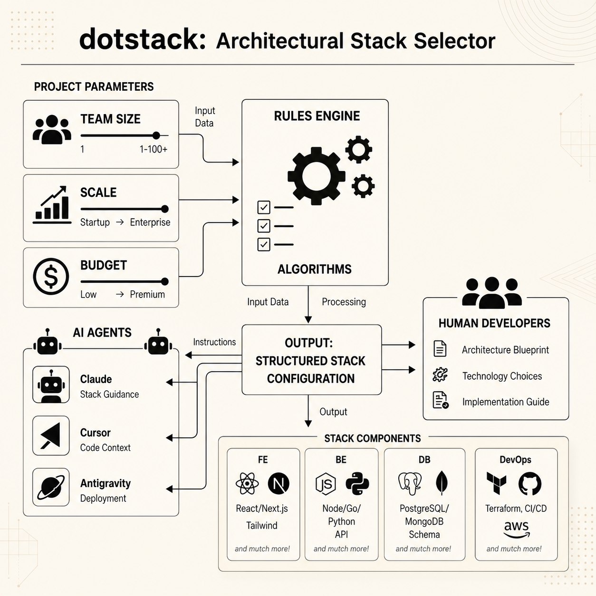

# dotstack

[](https://www.npmjs.com/)
[](https://github.com/andrecodexvictor/dotstack)
[](LICENSE)
[](https://github.com/andrecodexvictor/dotstack)

**dotstack** is a deterministic, rule-based technology stack recommendation engine built for human developers and AI coding agents. It evaluates project briefs and constraints to deliver optimal architectural selections, complete with curated design patterns, template references, and **offline vector space semantic search**.



### 🚀 Supported Technologies & Frameworks
The scoring engine evaluates and selects from the following platforms across **13 categories**:
- **Frontend (FE)**: React, Next.js, Vue, Nuxt, Svelte, SvelteKit, Angular, SolidJS, Astro, Remix, Qwik.
- **Backend (BE)**: Node.js (Express, NestJS, Fastify, Hono), Go (Gin, Fiber, Echo), Python (FastAPI, Django, Flask), Rust (Axum, Actix-web), Ruby on Rails, Elixir (Phoenix), PHP (Laravel, Symfony), Java (Spring Boot), Kotlin (Ktor), C# (ASP.NET Core), Scala (Play Framework).
- **AI & LLM Orchestration**: LangChain, LlamaIndex, LangGraph, CrewAI, AutoGen, Vector DBs (Qdrant, Pinecone, Weaviate, Chroma, pgvector).
- **Database (DB)**: PostgreSQL, MySQL, SQLite, MongoDB, Cassandra, Neo4j, DynamoDB, MariaDB, CockroachDB, Amazon Aurora, AWS RDS, GCP Cloud SQL, Google Spanner, Azure SQL, CosmosDB, Firestore, Supabase, PlanetScale, Neon, TiDB.
- **Caching**: Redis, Memcached, Varnish, CDNs.
- **Observability**: OpenTelemetry, Prometheus, Grafana, Loki, Sentry, Datadog, New Relic, AWS CloudWatch, ELK.
- **Messaging & Queueing**: Apache Kafka, RabbitMQ, NATS, AWS SQS, Google Pub/Sub, Redis Streams, Amazon Kinesis, EventBridge.
- **Testing**: Vitest, Jest, Pytest, JUnit, k6, Locust, Playwright, Cypress, Pact.
- **Auth / IDaaS**: Auth0, Keycloak, Supabase Auth, AWS Cognito, Firebase Auth, Clerk, NextAuth.js.
- **Security & DevSecOps**: Semgrep, SonarQube, Trivy, Snyk, Dependabot, HashiCorp Vault, AWS KMS, AWS WAF.
- **Orchestration**: Kubernetes, Docker Compose, AWS ECS/Fargate, Cloud Run, App Runner, Nomad.
- **Mobile & Desktop**: React Native, Flutter, SwiftUI, Jetpack Compose, .NET MAUI, Expo, Capacitor, Tauri, Electron.
- **DevOps & Cloud**: AWS, GCP, Azure, Vercel, Render, Fly.io, Cloudflare, Supabase, Railway.

---

Instead of re-teaching every AI coding tool your project's architectural decisions from scratch, `dotstack` provides a durable, tool-agnostic stack configuration layer. 

By exposing a native **Model Context Protocol (MCP) server** and an **offline semantic search engine**, agents can automatically read, validate, and search codebases under the target architecture's constraints.

---

## What Dotstack Is

`dotstack` is three things at once:
1. 📝 **A Standard Input Specification**: A simple `dotstack-project.yaml` defining product goals, scale, budget, and team experience.
2. ⚙️ **A Pure TypeScript Rules Engine & Search Engine**: A deterministic scoring compiler and a local TF-IDF vector space engine decoupled from Node.js (usable in CLI, browser, serverless, or MCP runtimes).
3. 📦 **An Agent-Friendly Tool Surface**: Exposes recommendations, patterns, and semantic search to CLI shells and MCP-enabled AI clients (Cursor, Claude Code, Windsurf, Claude Desktop, etc.).

---

## Getting Started / Como Começar

### Path 1: Agent & IDE Integration via MCP (Recommended)
Use this path to automatically register the `dotstack` tools in your AI editors.

**One-command automatic setup** — configures Claude Desktop, Claude Code, Cursor, VS Code Copilot, Windsurf, Codex CLI, and a project-level `.mcp.json` all at once:
```bash
npx -y dotstack@latest mcp install
```

Or target a specific agent:
```bash
npx dotstack mcp install claude    # Claude Desktop + Claude Code CLI
```

**Available MCP Tools** — once connected, AI agents can call:
- `dotstack_init`: Instantiates parameter files.
- `dotstack_recommend`: Evaluates project briefs and writes recommendation reports.
- `dotstack_patterns`: Resolves design pattern guidelines and templates.
- `dotstack_semantic_search`: Performs offline vector space searches over code chunks.
- `dotstack_audit`: Scans workspace dependency configuration files and checks alignment.
- `dotstack_migrate`: Generates step-by-step custom migration blueprints.
- `dotstack_docs`: Compiles Architecture Decision Records (ADRs) programmatically.

---

### Path 2: Standalone CLI & Local Semantic Search
Use this path to initialize, evaluate, and search repositories directly from the terminal.

1. **Initialize project brief**:
   ```bash
   npx dotstack init
   ```
   *Creates a default template `dotstack-project.yaml` in your working directory.*

2. **Generate recommendations**:
   ```bash
   npx dotstack recommend
   ```
   *Evaluates your parameters and outputs recommendation reports to `.stack/` (or `.context/dotstack/` if a context manager directory exists).*

3. **Perform local semantic searches**:
   Run an offline token-vector search over code chunks in your repository:
   ```bash
   npx dotstack search "database connection cache rules"
   ```
   *Scans files recursively, constructs a local TF-IDF index, computes cosine similarity, and outputs matching code snippets with scores and deep links.*

---

### Caminho em Português: Integração & CLI Local

1. **Configurar o Servidor MCP**:
   ```bash
   npm run build
   npx dotstack mcp install
   ```
   *Registra automaticamente as ferramentas do `dotstack` no seu **Cursor** ou **Claude Desktop**.*

2. **Buscar código semanticamente offline**:
   ```bash
   npx dotstack search "regras da engine de recomendação"
   ```
   *Varre a base de código, calcula pesos TF-IDF e retorna os trechos de código mais semelhantes (cosseno de similaridade).*

---

## CLI Reference

### `dotstack init`
Generates a template `dotstack-project.yaml` parameter file.
- `-o, --output <path>`: Custom path for configuration file (default: `dotstack-project.yaml`).

### `dotstack recommend`
Analyzes parameters, logs risk alerts (e.g. over-engineering flags), and writes output reports.
- `-f, --file <path>`: Path to project brief configuration (default: `dotstack-project.yaml`).
- `-r, --root <path>`: Project workspace root path for output routing (default: `.`).
- `--format <type>`: Output format of the report (text, json, markdown). Default is text.
- `--verbose`: Enable verbose configuration logs.
- `--dry-run`: Evaluate recommendations without writing files to disk.
- `-o, --output <path>`: Save report output to custom location.

### `dotstack search <query>`
Scans codebases and runs local TF-IDF token vector cosine similarity matching.
- `-r, --root <path>`: Workspace directory to scan (default: `.`).
- `-k, --top-k <number>`: Maximum matching code blocks to return (default: `5`).

### `dotstack mcp start`
Starts the stdio-based MCP server.

### `dotstack mcp install [target]`
Automatically registers the stdio MCP server in local Cursor and/or Claude Desktop configurations.
- `target`: `cursor`, `claude`, or `all` (default: `all`).

---

## SDK / Programmatic API Usage

Because `dotstack` isolates its Core Domain via Ports and Adapters, you can import and run the rules engine, migration planner, stack auditor, or the semantic search indexer in browsers, serverless functions, or custom extensions:

```typescript
import { RecommendationService, SemanticSearchService } from 'dotstack';

// 1. Get recommendation
const service = new RecommendationService();
const recommendation = service.recommend({
  product: { name: "Analytics Service", type: "API" },
  team: { devs: 4, experience: "senior" },
  requirements: { scale: "high", latency: "low-latency" }
});

console.log(recommendation.recommendation.backend); // Outputs: "Go (Gin)"

// 2. Perform programmatical search
const searchService = new SemanticSearchService();
const matches = searchService.search([
  { relativePath: "index.js", content: "const app = express();" }
], "express app setup");
```

---

## Curated Pattern & Ecosystem Mappings

For every recommended stack, `dotstack` embeds direct references to educational codebases and architecture guides:

| Stack Recommendation | Embedded Patterns | Curated Reference Repository |
| :--- | :--- | :--- |
| **TypeScript (NestJS) + PostgreSQL** | Clean Architecture, Repository, CQRS, DI | [nestjs-realworld-example-app](https://github.com/lujakob/nestjs-realworld-example-app) |
| **TypeScript (Express) + PostgreSQL** | Ports & Adapters, Service Boundary | [node-clean-architecture](https://github.com/fityanu/node-clean-architecture) |
| **Go (Gin) + PostgreSQL** | Clean Architecture, Repository | [go-clean-arch](https://github.com/bxcodec/go-clean-arch) |
| **Python (Django) + PostgreSQL** | Model-View-Template (MVT) | [cookiecutter-django](https://github.com/cookiecutter/cookiecutter-django) |
| **Java (Spring Boot)** | Dependency Injection, IoC, Repository | [spring-boot-api-project](https://github.com/maciejwalkowiak/spring-boot-api-project) |

---

## Developer Guide & Codebase Contributions

1. **Install dependencies**:
   ```bash
   npm install
   ```

2. **Verify and run tests**:
   ```bash
   npm run test
   ```
   *We use Vitest to run rules, file-routing, and semantic search unit tests.*

3. **Build compiled assets**:
   ```bash
   npm run build
   ```
   *Compiles source code into ESM JavaScript under `dist/`.*

---

## License & Credits

Distributed under the MIT License. See [LICENSE](LICENSE) for details.

- **Author**: André Victor A. O. Santos
- **Inspiration**: Strongly inspired by [dotcontext](https://github.com/andrecodexvictor/dotarchitecture) repo conventions.
